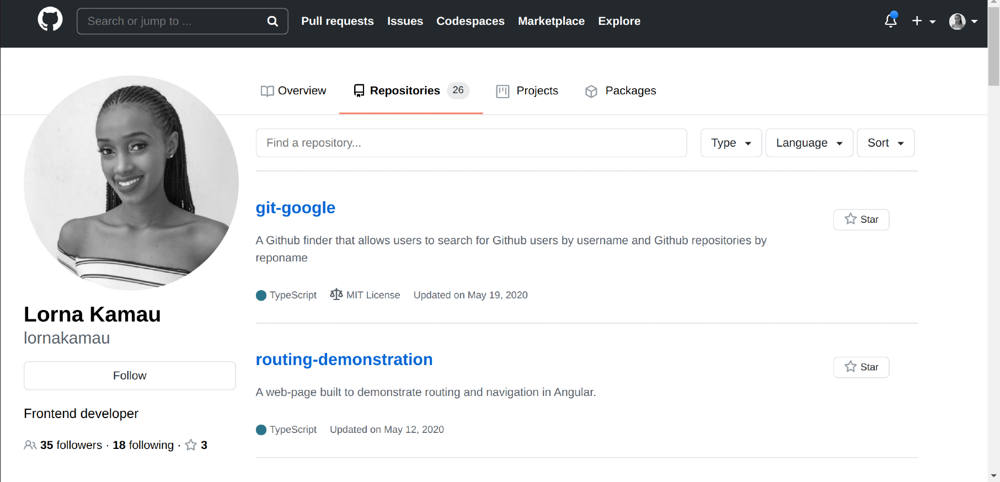

# GitHubProfile
#### A clone of GitHub's profile page , 27/05/2021.
#### By Lorna Kamau

## Description
A clone of GitHub's profile page. One can search for a user's profile and repositories by entering the username in the search field located in the navbar.  No CSS or JS frameworks were used in the development of this application.
While every other page functionality and style was cloned, the following features were left out:
1. Overview, Packages and Projects tabs
2. Graph showing year of activity for the repository
3. Pagination of repositories (only the first 20 are loaded)

## Live link
Visit the application on https://githubprofile-c4d85.web.app

## Development

#### Development server

Run `ng serve` for a dev server. Navigate to `http://localhost:4200/`. The app will automatically reload if you change any of the source files.

#### Code scaffolding

Run `ng generate component component-name` to generate a new component. You can also use `ng generate directive|pipe|service|class|guard|interface|enum|module`.

#### Build

Run `ng build` to build the project. The build artifacts will be stored in the `dist/` directory. Use the `--prod` flag for a production build.

#### Running unit tests

Run `ng test` to execute the unit tests via [Karma](https://karma-runner.github.io).

#### Running end-to-end tests

Run `ng e2e` to execute the end-to-end tests via [Protractor](http://www.protractortest.org/).

#### Further help

To get more help on the Angular CLI use `ng help` or go check out the [Angular CLI Overview and Command Reference](https://angular.io/cli) page.

#### Making modifications

To make advancements/modifications, follow these steps:

- Fork the repository
- Create a new branch (`git checkout -b improve-feature`)
- Make the appropriate changes in the files
- Add changes made
- Commit your changes (`git commit -am 'Improve feature'`)
- Push to the branch (`git push origin improve-feature`)
- Create a Pull Request 

## Technologies Used

[Angular CLI](https://github.com/angular/angular-cli) version 11.0.2.

## Support and contact details

Should you be unable to access the website, have any recommendations and/or questions, feel free to email me:[kamaulorna@gmail.com](mailto:kamaulorna@gmail.com)

## [License](https://github.com/lornakamau/git-google/blob/master/LICENSE.md)

Copyright (c) 2021 [Lorna Kamau](https://github.com/lornakamau)  

